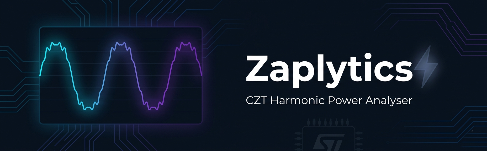

<!-- BANNER — replace the image below with your project banner (recommended: 1280×400 px) -->
<div align="center">
  
</div>

<br/>

<div align="center">

# ⚡ Zaplytics — CZT Harmonic Power Analyser

*Real-time embedded power quality analysis on STM32G474RE*

<br/>

<!-- Core Stack -->
[](https://www.st.com/)
[](https://en.wikipedia.org/wiki/C_(programming_language))
[](https://www.arm.com/)

<!-- Tooling -->
[](https://www.st.com/en/development-tools/stm32cubeide.html)
[](https://www.python.org/)
[](https://numpy.org/)
[](https://matplotlib.org/)

<!-- Algorithm & Protocol -->
[](https://en.wikipedia.org/wiki/Chirp_Z-transform)
[]()
[]()

<!-- Project Status -->
[]()
[](LICENSE)
[]()

<br/>

> A real-time embedded power quality analyser on the **STM32G474RE** (ARM Cortex-M4 @ 170 MHz) that simultaneously measures mains voltage and current, extracts harmonics H1–H10 using the **Chirp Z-Transform (CZT)**, and reports THD, active power, apparent power, and power factor — every **100 ms**.

</div>

---

## 📺 Demo

<!-- ================================================================ -->
<!--  HOW TO UPDATE: Just paste your YouTube URL in the two places    -->
<!--  marked below. The thumbnail is pulled automatically from        -->
<!--  YouTube — no need to upload or host any image yourself.         -->
<!--                                                                  -->
<!--  YouTube thumbnail URL format:                                   -->
<!--  https://img.youtube.com/vi/YOUR_VIDEO_ID/maxresdefault.jpg      -->
<!--                                                                  -->
<!--  Example — if your video link is:                                -->
<!--    https://www.youtube.com/watch?v=dQw4w9WgXcQ                  -->
<!--  Your VIDEO_ID is: dQw4w9WgXcQ                                   -->
<!--                                                                  -->
<!--  Replace YOUR_VIDEO_ID in the two lines below and you're done.   -->
<!-- ================================================================ -->

<div align="center">
  <a href="https://www.youtube.com/watch?v=Ojo8Qb8PuJw">
    
    <br/><br/>
    
  </a>
  <br/><br/>
  <i>Click the thumbnail above to watch the full project demonstration.</i>
</div>

---

## 📋 Project Info

<div align="center">

| Field | Details |
|:---|:---|
| **Course** | 23EEE351 – Embedded System Design |
| **Institution** | Amrita School of Engineering, Coimbatore |
| **Department** | Electrical and Electronics Engineering |
| **Semester** | Third Year B.Tech. (EEE), VI Semester |
| **Regulation** | 2023 |
| **Guide** | Dr. Sivraj P., Assistant Professor (SG) |

</div>

### 👥 Team Members

<div align="center">

| Name | GitHub | LinkedIn |
|:---|:---:|:---:|
| Gopika Gokul | [](https://github.com/gopika-777) | [](https://www.linkedin.com/in/gopika-gokul-773201351/) |
| Anmol Govindarajapuram Krishnan | [](https://github.com/Anmol-G-K) | [](https://www.linkedin.com/in/anmolkrish/) |
| Harish R | [](https://github.com/Hackyharish) | [](https://www.linkedin.com/in/harish-r-8b68a333b/) |
| Mauli Rajguru | [](https://github.com/maulirajguru) | [](https://www.linkedin.com/in/maulir/) |

</div>

---

## 🔍 What It Does

Modern non-linear loads (SMPS, LED drivers, EV chargers) inject harmonic currents into the grid. This project implements a **low-cost "Fluke-lite"** analyser for educational and SME environments that measures:

| Feature | Description |
|:---|:---|
| ✅ **True RMS** | Voltage (up to 250 V) and current (up to ±30 A) |
| ✅ **Harmonics H1–H10** | 50 Hz – 500 Hz at **0.5 Hz resolution** — 20× finer than a direct FFT |
| ✅ **THD** | Total Harmonic Distortion for both voltage and current channels |
| ✅ **Power Metrics** | Active power (W), Apparent power (VA), Power Factor, and Phase Angle |
| ✅ **Frequency Detection** | Mains frequency via hysteresis zero-crossing |
| ✅ **Live Outputs** | SSD1306 OLED display + real-time Python dashboard over serial |

---

## 🔧 Hardware

<div align="center">

| Component | Role | Pin |
|:---|:---|:---|
| STM32G474RE (NUCLEO) | Main MCU @ 170 MHz, Cortex-M4 + FPU | — |
| ZMPT101B (5 V) | Voltage sensor, galvanic isolation | PA0 → ADC1_IN1 |
| WCS1700 (5 V) | Current sensor, Hall-effect, ±30 A | PA6 → ADC2_IN6 |
| SSD1306 OLED (128×64) | Local display | PB8 (SCL), PB9 (SDA) via I2C1 |
| 10kΩ/10kΩ resistor dividers | Signal conditioning (5 V → 3.3 V safe) | Both channels |
| ST-Link VCP | UART telemetry to PC | PA2 (TX), PA3 (RX) |

</div>

### 📡 Block Diagram (Signal Chain)

```
ZMPT101B ──→ 10k/10k divider ──→ PA0 (ADC1_IN1) ──┐
                                                    ├──→ TIM1 TRGO @ 10 kHz
WCS1700  ──→ 10k/10k divider ──→ PA6 (ADC2_IN6) ──┘         │
                                                            ▼
                                                 Dual Simultaneous ADC
                                                DMA1 Ch1 → adc_dual_buf[]
                                                            │
                                              HAL_ADC_ConvCpltCallback
                                                            │
                                                    Process_Buffer()
                                              ┌─────────────┴──────────────┐
                                        CZT Engine                   Power Metrics
                                       H1–H10 + THD               P, S, PF, Phase
                                              └─────────────┬──────────────┘
                                                     ┌──────┴──────┐
                                                SSD1306 OLED    LPUART1
                                                (I2C + DMA)   @ 209700 bps
```

---

## ⚙️ Key System Parameters

<div align="center">

| Parameter | Value |
|:---|:---|
| MCU | STM32G474RE, Cortex-M4 @ 170 MHz |
| ADC resolution | 12-bit (0–4095 counts) |
| Sample rate | 10 kHz (TIM1 TRGO triggered) |
| Samples per frame | 1000 (100 ms window = 5 mains cycles) |
| CZT frequency span | 0–500 Hz |
| CZT frequency resolution | **0.5 Hz/bin** |
| Harmonics extracted | H1–H10 (50 Hz to 500 Hz) |
| UART baud rate | 209,700 bps (LPUART1, 8N1) |
| UART TX buffer | 2 × 2048 bytes (ping-pong) |
| Voltage calibration factor | 623.81 (empirically determined) |
| Current sensitivity (at ADC) | 16.5 mV/A (after 0.5× divider) |

</div>

---

## 🧮 Methodology

### Dual Simultaneous ADC Sampling
ADC1 (voltage) and ADC2 (current) are triggered simultaneously by TIM1 TRGO, ensuring **zero phase delay** between channels — critical for accurate power factor measurement. Results are packed into one 32-bit DMA word per sample:
- `bits[15:0]` → ADC1 (voltage)
- `bits[31:16]` → ADC2 (current)

### DC Bias Estimation
Uses a **peak-averaging algorithm** — averages the 10 lowest and 10 highest samples to estimate the DC midpoint, robust against noise spikes.

### True RMS Calculation
```
Vrms = sqrt(Σ(v[n] - bias)² / N) × (Vref / ADC_RES) × CAL_FACTOR_V
```
Accumulated in **double precision** to prevent floating-point underflow.

### Chirp Z-Transform (CZT)
Unlike a standard FFT (10 Hz/bin at N=1000), the CZT zooms into the 0–500 Hz band at **0.5 Hz resolution** using Bluestein's identity. The voltage channel uses a **Hann window** to suppress leakage; the current channel uses a **rectangular window** to preserve amplitude accuracy.

### Power Metrics
```
P  = (1/N) Σ v_inst[n] · i_inst[n]        (Active Power, W)
S  = Vrms × Irms                           (Apparent Power, VA)
PF = P / S                                 (Power Factor)
φ  = arccos(PF) × 180/π                   (Phase Angle, degrees)
```

### THD Calculation
```
THD = sqrt(Σ A_h² for h=2..10) / A_1 × 100%
```

---

## 🏗️ Software Architecture

### Peripheral Map

<div align="center">

| Peripheral | Mode | Role |
|:---|:---|:---|
| ADC1 | DMA, Dual Simultaneous Master | Voltage channel (PA0) |
| ADC2 | Slaved to ADC1 | Current channel (PA6) |
| TIM1 | TRGO update @ 10 kHz | ADC sample clock |
| DMA1 Ch1 | Priority 0 | ADC → `adc_dual_buf[]` |
| DMA1 Ch2 | Priority 0 | I2C OLED framebuffer |
| LPUART1 | Interrupt-driven TX | PC telemetry @ 209,700 bps |
| I2C1 | DMA-driven @ 400 kHz | SSD1306 OLED display |

</div>

### UART Ping-Pong TX System
Two 2048-byte buffers allow the main loop to assemble the next frame while HAL transmits the previous one — **no blocking delays**.

```c
UART_Print_IT("message");   // append to write buffer (non-blocking)
UART_Flush_IT();            // swap buffers, start HAL_UART_Transmit_IT()
```

### Main Loop (Superloop)
```c
while (1) {
    if (capture_done) {
        capture_done = 0;
        HAL_GPIO_TogglePin(LD2_GPIO_Port, LD2_Pin);  // heartbeat LED
        Process_Buffer();   // full DSP pipeline
    }
}
```

---

## 🖥️ OLED Display Layout

<div align="center">

| Page | Content |
|:---|:---|
| 0 | `-- Power Monitor --` |
| 2 | `Vrms : 230.1 V` |
| 3 | `Irms : 0.45 A` |
| 5 | `Power: 102.6 W` |
| 6 | `PF   : 0.99` |

</div>

---

## 📡 Serial Output Format

Each 100 ms frame produces one complete telemetry block over LPUART1:

```
[V] Min: 890 Max:3174 Pk-Pk:2284 Bias:2032.0 Freq:50.00Hz VRMS:230.1234V
[V] CZT Harmonics (fund=50.00Hz  fR=0.5000Hz)
H01 ( 50Hz): 230.1234V  [bin 100]
H02 (100Hz):   1.2345V  [bin 200]
...
THD:   0.54%

[I] Bias:1437 | V_adc=1.158V V_sens=2.316V | PkPk:420 | Freq:50.00Hz | IRMS:5.1234A
[I] CZT Harmonics (fund=50.00Hz  fR=0.5000Hz)
H01 ( 50Hz):  5.1234A rms  [bin 100]
...
THD:   3.21%

[PWR] Active:  1178.23 W | Apparent:  1183.75 VA | PF: 0.995 | Phase:   5.7 deg
----------------------------------------
```

---

## 📊 Results

<div align="center">

| Parameter | Firmware | DMM Reference | Error |
|:---|:---:|:---:|:---:|
| Vrms | 230.08 V | 230.1 V | 0.009% |
| Irms | 0.446 A | 0.44 A | 1.36% |
| Voltage THD | 0.23% | — | Clean mains |
| Current THD | 10–16% | — | WCS1700 noise floor at low current |

</div>

> **Note:** Power factor error (PF = 0.846 vs expected ≈1.0 for resistive load) is due to the WCS1700 Hall-effect noise floor at the low 0.44 A test current. Performance improves significantly at higher loads.

---

## 🚀 Build & Flash

### Requirements
- STM32CubeIDE (with CubeMX)
- STM32 HAL library for G4 series
- SSD1306 I2C-DMA driver (`ssd1306.h` / `ssd1306.c`)

### Steps
```bash
# 1. Clone the repo
git clone https://github.com/Anmol-G-K/Zaplytics.git
cd Zaplytics

# 2. Open in STM32CubeIDE
# File → Open Projects from File System → select the Power_Analyser folder

# 3. Build
# Project → Build All  (Ctrl+B)

# 4. Flash
# Run → Debug (F11) or Run → Run (Ctrl+F11) via ST-Link
```

### 🔩 Two-Step Calibration (after first flash)
1. **Zero calibration** — With no load connected, read `[I] Bias:` from UART and set `V0G_COUNTS_CAL` to that value in `main.c`
2. **Gain calibration** — With a known resistive load, compare `IRMS` against a reference DMM and trim `CAL_GAIN` until they match

---

## 📈 Python Dashboard

```bash
pip install pyserial numpy matplotlib
python dashboard.py   # set correct COM port inside the script
```

The dashboard renders live at 250 ms intervals:

- 📟 KPI cards for Vrms, Irms, Active / Apparent / Reactive Power
- 📉 Rolling trend plots (120 points)
- 📊 Per-channel CZT harmonic bar charts (H1–H10)
- 🔵 Semicircular power factor gauge
- 🟢 THD indicators (green < 5%, red ≥ 5%)

---

## 🌍 SDG Contributions

<div align="center">

| SDG | Contribution |
|:---|:---|
| **SDG 4** Quality Education | Open-source platform for learning real-time DSP and embedded design |
| **SDG 7** Affordable and Clean Energy | Low-cost power quality monitoring vs. expensive industrial analysers |
| **SDG 9** Industry, Innovation and Infrastructure | Accessible diagnostic tool for resilient industrial systems |
| **SDG 12** Responsible Consumption and Production | Detects harmonics causing premature equipment failure, reducing e-waste |

</div>

---

## 📄 License

This project is licensed under the **MIT License** — see [LICENSE](LICENSE) for details.

---

<div align="center">

Made with ❤️ at **Amrita School of Engineering, Coimbatore**

[](https://github.com/Anmol-G-K/Zaplytics)
[](https://github.com/Anmol-G-K/Zaplytics/fork)

</div>
